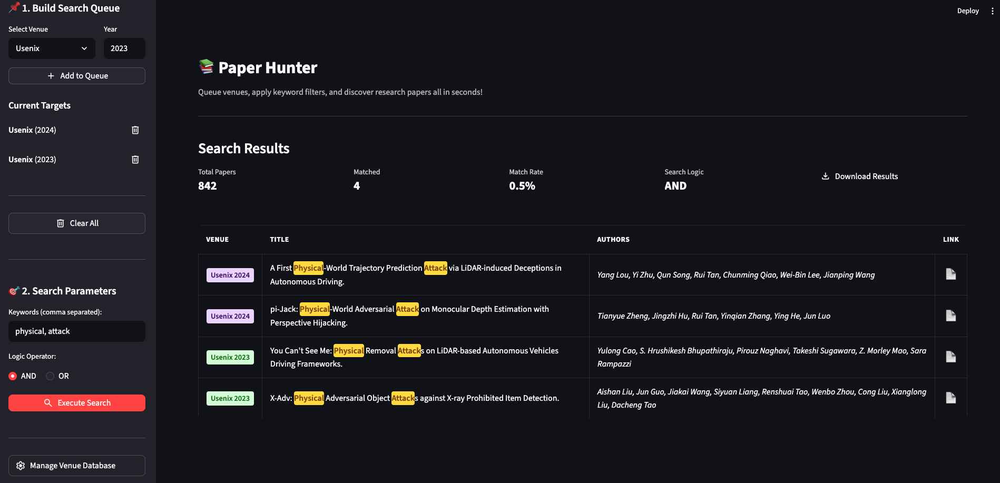

# Paper Hunter - Paper Discovery Tool



A professional Python application for discovering academic papers by venue, year, and keywords.

## Project Structure

```
paper_hunter/
├── src/                          # Source code
│   ├── __init__.py
│   ├── core/                    # Core functionality
│   │   ├── __init__.py
│   │   ├── models.py           # Data models (Paper, SearchTarget)
│   │   ├── scraper.py          # Venues scraper
│   │   ├── search.py           # Search logic
│   │   └── venue_manager.py    # Venue database management
│   └── ui/                      # User interface
│       ├── __init__.py
│       ├── app.py              # Main Streamlit application
│       ├── components.py       # Reusable UI components
│       └── styles.py           # CSS styling
├── tests/                        # Unit tests
│   ├── __init__.py
│   ├── conftest.py
│   ├── test_search.py
│   └── test_venue_manager.py
├── config/                       # Configuration files
│   └── venues.json             # Venue database
├── assets/                       # Static assets
├── run.py                        # Application entry point
├── .flake8                       # Flake8 linting configuration
├── pyproject.toml                # Project metadata and tool config (Ruff, Black, isort)
├── requirements.txt              # Python dependencies
├── README.md                     # This file
└── LICENSE                       # License file
```

## Features

- **Venue Management**: Add, remove, and manage DBLP venue databases
- **Flexible Search**: Search papers by keywords with AND/OR logic
- **Multi-Venue Queuing**: Queue multiple venues and years for batch searching
- **Result Export**: Download search results as CSV
- **Keyword Highlighting**: Visual highlighting of matched keywords in results
- **Professional UI**: Modern, responsive Streamlit interface

## Installation

1. Clone the repository:
   ```bash
   git clone https://github.com/EdoardoAllegrini/paper_hunter.git
   cd paper_hunter
   ```

2. Create virtual environment:
   ```bash
   python3 -m venv venv
   source venv/bin/activate  # On Windows: venv\Scripts\activate
   ```

3. Install the package:
   - For standard use:
      ```bash
      pip install .
      ```
   - For development (includes tests, linters, and formatters):
      ```bash
      pip install -e ".[dev]"
      ```

4. Initialize the local configuration:
   ```bash
   cp config/venues.example.json config/venues.json
   ```

## Usage

### Running the Application

```bash
python run.py
```

Or directly with Streamlit:
```bash
streamlit run src/ui/app.py
```

### Using the Application

1. **Add Venues**: Go to "Manage Venue Database" to add DBLP venues with their acronyms
2. **Queue Searches**: Select a venue and year, then "Add to Queue"
3. **Search**: Enter keywords and select AND/OR logic
4. **Execute**: Click "Execute Search" to fetch and filter papers
5. **Export**: Download results as CSV

## Development

### Testing
I use pytest for unit testing and coverage reporting.

```bash
# Run all tests
pytest

# Run tests with coverage report
pytest --cov=src tests/
```

### Pre-commit Hooks

I use `pre-commit` so that it's trivial to run the same linters & configuration locally as in CI.

**Run all linters manually:**
```bash
pre-commit run --hook-stage=manual --all-files
```

Output:
```
isort....................................................................Passed
black....................................................................Passed
ruff.....................................................................Passed
flake8...................................................................Passed
mypy.....................................................................Passed
pytest (fast)............................................................Passed
```

**Run a single linter:**
```bash
pre-commit run --all-files --hook-stage=manual isort
```

Output:
```
isort....................................................................Passed
```

**Automatic Enforcement:**

Configure pre-commit to run automatically before every commit or push:
```bash
pre-commit install --hook-type=pre-commit
pre-commit install --hook-type=pre-push
```

This ensures you don't commit code style or formatting offenses. You can always temporarily skip the checks by using the `-n` or `--no-verify` git option.

### Code Structure

- **`src/core/`**: Business logic layer
  - `models.py`: Data structures
  - `scraper.py`: Web scraping logic
  - `search.py`: Search algorithm
  - `venue_manager.py`: Data persistence

- **`src/ui/`**: Presentation layer
  - `app.py`: Main Streamlit app
  - `components.py`: Reusable UI elements
  - `styles.py`: CSS styling

## Requirements

- Python 3.8+
- See `requirements.txt` for dependencies

## Configuration

The application uses `config/venues.json` to store your local database of venues. Because this file is modified by the application during runtime, it is excluded from version control.

### For new installations, you must create this file by copying the provided template:
```bash
cp config/venues.example.json config/venues.json
```

The JSON format expects the Venue Full Name as the key and the DBLP acronym as the value:
```json
{
    "Venue Full Name": "dblp_acronym",
    "USENIX Security": "uss",
    "ACM CCS": "ccs"
}
```

## License

See LICENSE file for details

## Author

Edoardo Allegrini
